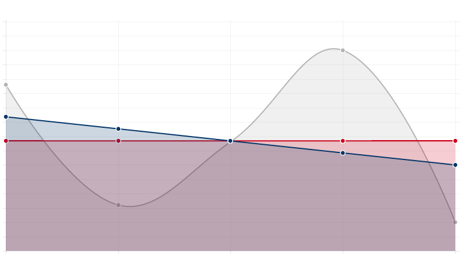

#datakit




##About
A lightweight library/framework for data analysis in JavaScript.

Check out this <a href="http://nathanepstein.github.io/jekyll/update/2015/02/26/jsdata.html">blog post</a> on the need for more JavaScript data tools.

##Usage

```npm install datakitjs --save```

##Documentation & Examples

###Reading, Filtering, & Plotting Data
```javascript
var dk = require('datakitjs');

//READ A CSV FILE

//file.csv
// COL1, COL2
// val11, val12
// val21, val22

dk.csv('file.csv', function(data) {
  console.log(data);
});

//Output:
//[{ COL1: val11, COL2: val12 }, { COL1: val21, COL2: val22 }]


//GET A COLUMN FROM AN ARRAY OF ROW OBJECTS
dk.csv('file.csv', function(data) {
  var c2 = dk.col(data, 'COL2');
  console.log(c2);
});

//Output:
//[val12, val22]

// By default, dk.csv will convert all values to strings. You can convert select
// columns to numbers by passing an array of column names to 'dk.numeric'.

//file2.csv
// COL1, COL2
// val11, 1
// val21, 2

dk.csv('file2.csv', function(data) {
  var d = dk.numeric(data, ['COL2'], 0) // The third parameter value will be filled
  // in to blank cells. Its default value is 0.
  var c2 = dk.col(d, 'COL2');
  console.log(c2);
});

//Output:
//[1, 2]


//PLOT ARRAY(S) OF DATA

var x1 = dk.norm(25);
var plot = dk.plot(x1); // x1 will be plotted on the y-axis, index on the x-axis
//dk.plot returns a string of the html used to create the plot.


var labels = dk.seq(1, 25);
var x2 = dk.norm(25);
var x3 = dk.norm(25);
dk.plot(labels, x1, x2, x3); //labels on the x-axis, the next three arrays will each be plotted on the y-axis
```

###Statistical Methods

```javascript
var dk = require('datakitjs');

//MEAN OF AN ARRAY
dk.mean([1, 2, 3]); //returns 2

//STANDARD DEVIATION AND VARIANCE OF AN ARRAY
dk.sd([1, 2, 3]); //returns 1
dk.vari([1, 2, 3]); //returns 1

//COVARIANCE OF TWO ARRAYS
dk.cov([1, 2, 3], [3, 2, 1]); //returns -1

//SIMPLE LINEAR REGRESSION

var x = [1, 2, 3];
var y = [2, 1, 3];

var model = dk.reg(x, y);

// model.f is a function that returns the estimated y for an input x (estimated via standard OLS regression)
// model.f = function(x) {
//  return (a + b * x);
// };

// model.pts is an array of the estimated y for each element of x
// model.pts = [1.5, 2, 2.5];

```

###Convenience Methods
```javascript
var dk = require('datakitjs');

//GENERATE AN ARRAY WITH A SEQUENCE OF NUMBERS

dk.seq(1, 5); //returns [1, 2, 3, 4, 5]

dk.seq(0, 1, 0.25); //returns [0, 0.25, 0.5, 0.75, 1]

//GENERATE AN ARRAY WITH REPEATED VALUE

dk.rep(1, 5); //returns [1, 1, 1, 1, 1]

//CHECK IF NUMBERS ARE CLOSE
dk.isclose(0, Math.pow(10, -15)); //returns true

dk.isclose(0, Math.pow(10, -5)); //returns false

//SUM AN ARRAY OF NUMBERS
//uses Kahan summation

dk.sum([1, 2, 3]); //returns 6

//PRODUCT OF AN ARRAY OF NUMBERS
//implementation from 'Accurate Floating Point Product' - Stef Graillat

dk.prod([1, 2, 3]); //returns 6

//MAX AND MIN OF AN ARRAY
var x = [1, 2, 3];
dk.min(x); //returns 1
dk.max(x); //returns 3

```

###Random Numbers
```javascript
var dk = require('datakitjs');

//GET AN ARRAY OF EXPONENTIALLY DISTRIBUTED VALUES

dk.exp(3, 1); //returns [0.3584189321510761, 1.0466439500242446, 0.08887770301056963]


//GET AN ARRAY OF NORMALLY DISTRIBUTED VALUES

dk.norm(3, 0, 1); //returns [-1.709768103193772, 0.23530041388459744, 0.4431320382580479]

//GET AN ARRAY OF UNIFORMLY DISTRIBUTED VALUES

dk.uni(3); //returns [0.30658303829841316, 0.1601463456172496, 0.8538850131444633]

```

##Testing

Just run `npm test` to run the tests.


##Contributing

Additional methods for random number generation, data filtration, convenience functions, and common statistical analyses are welcome additions. Just add tests following the structure in `spec/test/testSpec.js`.

## License

**The MIT License (MIT)**

> Copyright (c) 2015 Nathan Epstein
>
> Permission is hereby granted, free of charge, to any person obtaining a copy
> of this software and associated documentation files (the "Software"), to deal
> in the Software without restriction, including without limitation the rights
> to use, copy, modify, merge, publish, distribute, sublicense, and/or sell
> copies of the Software, and to permit persons to whom the Software is
> furnished to do so, subject to the following conditions:
>
> The above copyright notice and this permission notice shall be included in
> all copies or substantial portions of the Software.
>
> THE SOFTWARE IS PROVIDED "AS IS", WITHOUT WARRANTY OF ANY KIND, EXPRESS OR
> IMPLIED, INCLUDING BUT NOT LIMITED TO THE WARRANTIES OF MERCHANTABILITY,
> FITNESS FOR A PARTICULAR PURPOSE AND NONINFRINGEMENT. IN NO EVENT SHALL THE
> AUTHORS OR COPYRIGHT HOLDERS BE LIABLE FOR ANY CLAIM, DAMAGES OR OTHER
> LIABILITY, WHETHER IN AN ACTION OF CONTRACT, TORT OR OTHERWISE, ARISING FROM,
> OUT OF OR IN CONNECTION WITH THE SOFTWARE OR THE USE OR OTHER DEALINGS IN
> THE SOFTWARE.

